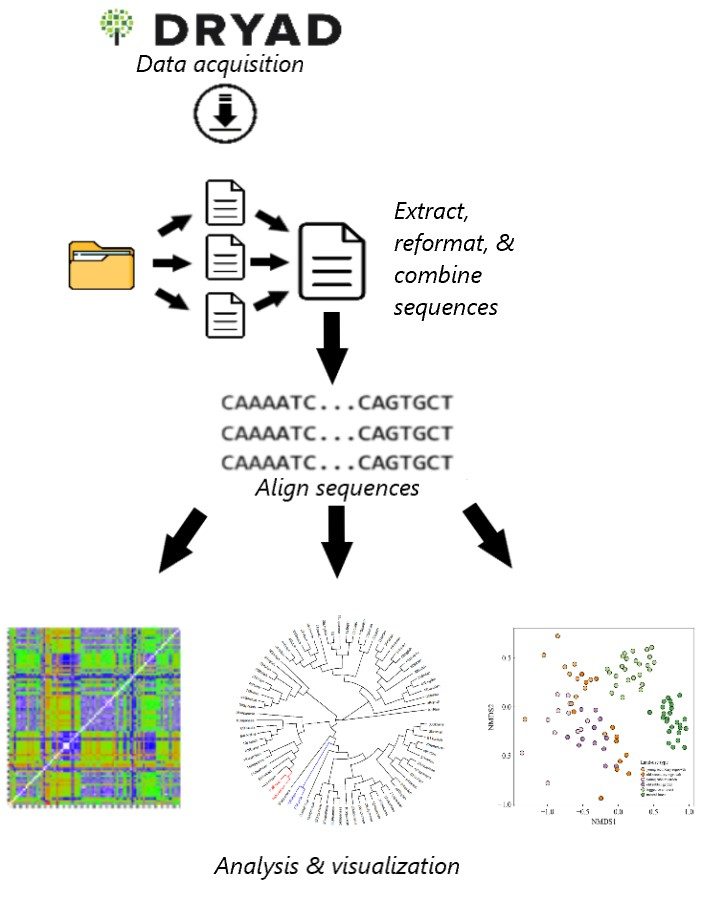

# Data-Pirates-Project
Here, we plan to analyze the sequences of 146 yeast strains to determine the evolutionary relationship among yeast species used in wine domestication. We will mainly focus on the following questions:  
1) Are wine yeast species that come from close geographic locations more closely genetically related?   
2) Does the oak niche show geographical limitation?   
3) What are the evolutionary relationships between the different strains of wine yeast?   
  
To answer these questions, we will follow the workflow outlined here:  

The predicted results are represented by the following figures: 

In this repository, you can find:

**Almeida_et_al_2015.pdf**: the published paper from which we obtained the data.  
**ChrISequences.csv**: a csv file containing the SNP loci for the first chromosome of 146 *S. cerevisiae* strains. 
**Concatenate.sh**: a bash script for submitting the R script used to concatenate the sequences from each chromosome into a single string for each strain.  
**ConcatenatedSequences.csv**: Contains the concatenated sequences for each strain.   
**ConcatenatedSequences.zip**: a compressed version of "ConcatenatedSequences.csv".  
**ConcatenateScript.R**: this script extracts all the relevant files and concatenates the DNA sequence into a single string for each strain. It is not recommended to try running this script on a local terminal. 
**Data-Pirates-Project.Rproj**: the R project associated with these codes.   
**FiguresScript.R**: This script contains the bulk of the code used for data manipulation and analysis. There is a section of code for reorganizing the Strains_info.csv file to make it more R friendly; a code section for importing the SNPs from chromosome 1 from the file "chrI_SNP_scere_largeDataset+Spar.fasta" from the "SNP-alignment-largeDataset+Spar" folder; and a section of code for generating the Distance Matrix, Phylogeny, and NMDS figures.    
**images**: output folder where the images are directed.   
**ordered_strains_info.csv**: output of "Figures.R" that contains R-friendly information about the substrate of isolation and country of discovery for each yeast strain.   
**PCA.R**: Script for running principal components analysis on "ConcatenatedSequences.csv".    
**SNP-alignment-largeDataset+Spar.tgz**: a compressed folder containing the raw data. Contains a fasta file for each chromosome with the SNPs for each strain.   
**Strain_info.csv**: contains information for each yeast strain about substrate of isolation and country of discovery.    
    
    
Required R packages to install before running scripts:  
 - ggplot2   
 - BiocManager    
 - Biostrings        
 - muscle    
 - ape    
 - readr    
 - dplyr     
 - reshape2    
 - ggtree    
 - vegan    
 - countrycode   
 - seqinr    
