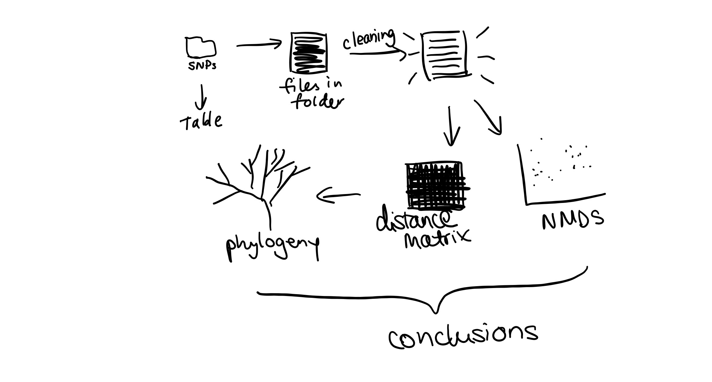
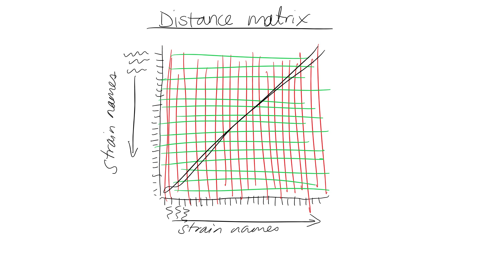
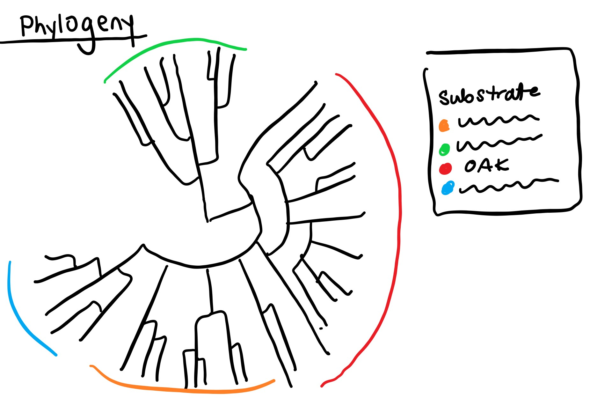
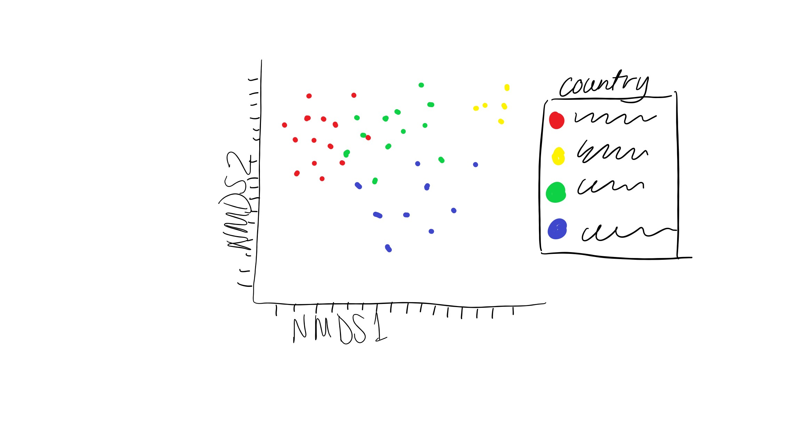

# Data-Pirates-Project
Here, we plan to analyze the sequences of 146 yeast strains to determine the evolutionary relationship among yeast species used in wine domestication. We will mainly focus on the following questions:  
1) Are wine yeast species that come from similar regions more closely genetically related?   
2) Does the oak niche show geographical limitation?   
3) What are the evolutionary relationships between the different strains of wine yeast?   
  
To answer these questions, we will follow the workflow outlined here:  

The predicted results are represented by the following figures: 

In this repository, you can find:

**Almeida_et_al_2015.pdf**: the published paper from which we obtained the data.  
**Concatenate.sh**: a bash script for submitting the R script used to concatenate the sequences from each chromosome into a single string for each strain.  
**ConcatenatedSequences.csv**: Contains the concatenated sequences for each strain.   
**ConcatenatedSequences.zip**: a compressed version of *ConcatenatedSequences.csv*.  
**Data-Pirates-Project.Rproj**: the R project associated with these codes.  
**SNP-alignment-largeDataset+Spar.tgz**: a compressed folder containing the raw data. Contains a fasta file for each chromosome with the SNPs for each strain.  
**Strain_info.csv**: contains information for each yeast strain about substrate of isolation and country of discovery. 